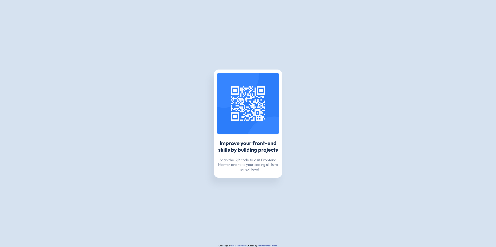

# Frontend Mentor - QR code component solution

This is a solution to the [QR code component challenge on Frontend Mentor](https://www.frontendmentor.io/challenges/qr-code-component-iux_sIO_H). Frontend Mentor challenges help you improve your coding skills by building realistic projects.

## Table of contents

- [Overview](#overview)
  - [Screenshot](#screenshot)
  - [Links](#links)
- [My process](#my-process)
  - [Built with](#built-with)
  - [What I learned](#what-i-learned)
- [Author](#author)

<!-- **Note: Delete this note and update the table of contents based on what sections you keep.** -->

## Overview

### Screenshot

### Links

- Solution URL: [Solution Repo](https://github.com/kSiasios/qr-code-component-main)
- Live Site URL: [The Solution](https://ksiasios.github.io/qr-code-component-main/)

## My process

### Built with

- HTML5
- CSS

### What I learned

This project was pretty straight forward. The only thing I had to do to make my workflow a bit easier and spare me the guessing, was opening the provided screenshot in Photoshop and measuring the dimensions of the elements (since I don't have a Premium Account to get the design files).

## Author

- GitHub - [Konstantinos Siasios](https://github.com/kSiasios)
- Frontend Mentor - [@kSiasios](https://www.frontendmentor.io/profile/kSiasios)
